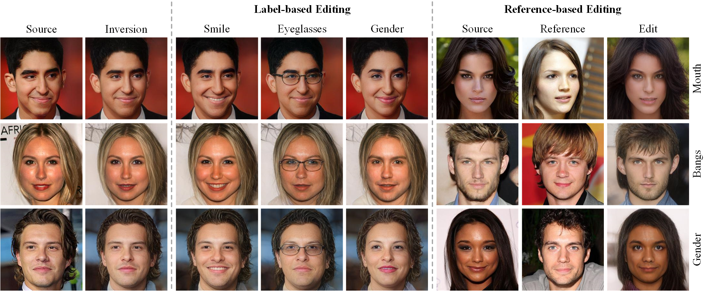

# Style Transformer for Image Inversion and Editing (CVPR2022)
 [](https://openaccess.thecvf.com/content/CVPR2022/html/Hu_Style_Transformer_for_Image_Inversion_and_Editing_CVPR_2022_paper.html) [](https://arxiv.org/abs/2203.07932) [](https://youtu.be/5VL2yYCgByQ)
> Existing GAN inversion methods fail to provide latent codes for reliable reconstruction and flexible editing simultaneously. This paper presents a transformer-based image inversion and editing model for pretrained StyleGAN which is not only with less distortions, but also of high quality and flexibility for editing. The proposed model employs a CNN encoder to provide multi-scale image features as keys and values. Meanwhile it regards the style code to be determined for different layers of the generator as queries. It first initializes query tokens as learnable parameters and maps them into $W^+$ space. Then the multi-stage alternate self- and cross-attention are utilized, updating queries with the purpose of inverting the input by the generator. Moreover, based on the inverted code, we investigate the reference- and label-based attribute editing through a pretrained latent classifier, and achieve flexible image-to-image translation with high quality results. Extensive experiments are carried out, showing better performances on both inversion and editing tasks within StyleGAN.

<p align="center">

<br>
Our style transformer proposes novel multi-stage style transformer in w+ space to invert image accurately, and we characterize the image editing in StyleGAN into label-based and reference-based, and use a non-linear classifier to generate the editing vector.
</p>

## Getting Started
### Prerequisites
- Ubuntu 16.04
- NVIDIA GPU + CUDA CuDNN
- Python 3

## Pretrained Models
We provide the pre-trained models of inversion for face and car domains.
- [FFHQ Inversion Model](https://drive.google.com/file/d/1XJWP712o-wWZrfzXJ07vc3dHjJF8CanT/view?usp=sharing)
- [Stanford Cars Inversion Model](https://drive.google.com/file/d/1ri10_CWq42IzzIQ4ZQAxNX7BLsCztd92/view?usp=sharing)

## Training
### Preparing Datasets
Update `configs/paths_config.py` with the necessary data paths and model paths for training and inference.
```
dataset_paths = {
    'train_data': '/path/to/train/data'
    'test_data': '/path/to/test/data',
}
```
### Preparing Generator and Encoder
We use rosinality's [StyleGAN2 implementation](https://github.com/rosinality/stylegan2-pytorch).
You can download the 256px pretrained model in the project and put it in the directory `/pretrained_models`.

Moreover, following pSp, we use some pretrained models to initialize the encoder and for the ID loss, you can download them from [here](https://github.com/eladrich/pixel2style2pixel) and put it in the directory `/pretrained_models`.

### Training Inversion Model
```
python scripts/train.py \
--dataset_type=ffhq_encode \
--exp_dir=results/train_style_transformer \
--batch_size=8 \
--test_batch_size=8 \
--val_interval=5000 \
--save_interval=10000 \
--stylegan_weights=pretrained_models/stylegan2-ffhq-config-f.pt
```

## Inference
```
python scripts/inference.py \
--exp_dir=results/infer_style_transformer \
--checkpoint_path=results/train_style_transformer/checkpoints/best_model.pt \
--data_path=/test_data \
--test_batch_size=8 \
```

## Citation
If you use this code for your research, please cite
```
@inproceedings{hu2022style,
  title={Style Transformer for Image Inversion and Editing},
  author={Hu, Xueqi and Huang, Qiusheng and Shi, Zhengyi and Li, Siyuan and Gao, Changxin and Sun, Li and Li, Qingli},
  booktitle={Proceedings of the IEEE/CVF Conference on Computer Vision and Pattern Recognition},
  pages={11337--11346},
  year={2022}
}
```
